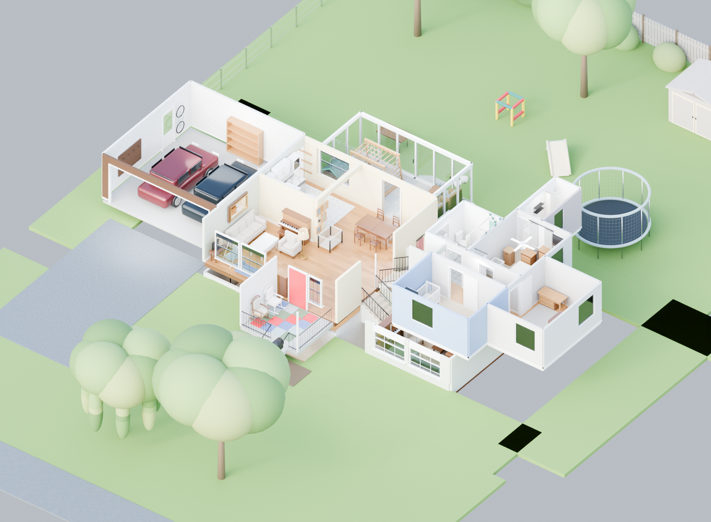

# House model — photo study, including basement and garage

The [orientation audit](ORIENTATION.md) records the comparison of all 40 photos,
the corrections, and the relationships that remain estimated.

A separate [first-person walkthrough test](../../house-test/) uses this model.
It is not linked from the arcade home page. See its [controls and rebuild notes](../../house-test/README.md).
The visible front/back yards now include lawn, planting beds, trees, a driveway,
rear shed, trampoline, play equipment and fencing, based on photos 1–5 and V4–V5.
Their distances and the lot boundary are estimates. See [front yard](previews/front_yard.png)
and [back yard](previews/back_yard.png).

Open **[house.blend](house.blend)** in Blender 4.5 LTS or newer. It opens with
an overview camera and an editable model organized into room collections.
This is an architectural/furniture study, with approximate dimensions;
it is not a surveyed floor plan or a finished house reconstruction.



## What is modeled

| Area | Photo references | Included |
| --- | --- | --- |
| Sunroom | 1–5 | Three glazed sides, sliding frames and handles, house siding, ceiling panels, clean foam flooring, wooden climbing gym with monkey bars/ladder/net/holds/swing, green-roof playhouse, wicker loveseat/chair/table, arched shelf, two-cup floor lamp |
| Kitchen | 6 | L-shaped white raised-panel cabinets, glass cupboard, subway backsplash, patterned floor, stone counters, double sink and gooseneck faucet, French-door refrigerator, range/oven, microwave, dishwasher |
| Dining and entry | 6–7 | Dark dining table, estimated dining chairs, multi-drawer cabinet, entry chest, playpen, simplified gallery frames, thermostat, red three-panel front door |
| Living room | 7–8 | Oatmeal sofa and armchair, small blue sofa, white activity table, side table, TV/stand, lamps, large mirror, upright piano/bench, baby swing |
| Split-level stairs | 7, 9–10 | Parallel up/down flights, beige carpet, black iron rails with twisted details, white upper gate, upper landing and door |
| Lower family room | 9–10, V6–V7 | Carpet, timber wainscot, fireplace with white surround and mantel, TV, blue sofa, green floor cushion, tan armless seat, dark recliner, coffee table, cubbies and storage drawers, ceiling fan, side windows |

The second and third photo sets add:

| Area | References | Included |
| --- | --- | --- |
| Upstairs hall | U1, U10; homeowner directions | Straight from the upper landing; green bathroom first left, main bedroom left, nursery right, other bedroom at the end; oak floor and empty coat hooks |
| Green family bathroom | U3–U5 | Sea-green tub tile, pale accent band, white tap-wall patch, bathtub, chrome fittings, curtain, white vanity, basin, mirror, toilet, linen shelves and patterned floor |
| Blue nursery | U6 | Blue walls, blind and grey curtains, white crib, cushioned wood rocking chair, footstool, wood chest, white chest and closed drawer organizer |
| Cory's bedroom (end of upstairs hall) | U7, U10 | Single bed along the right window wall, foot toward the ottoman; open rug, trellis curtains, desk/drawers, narrow bookcase, empty hammock and handles between curtain and bookcase |
| Main bedroom and ensuite | U8–U9, V1–V2 | Made double bed, bassinet, dressers, hamper, closet shelf/rail and drawer units, TV and ceiling fan; separate shower, vanity, mirror, toilet, window and empty wall baskets |
| Lower bedroom and bathroom | V6, V8–V10 | Connecting hall, corner-window bedroom, made bed, bookcase, low cabinet, bedside drawers and curtained closet; bathroom with vanity, toilet and window |
| Lower-room additions | V6–V7 | Second piano, adjustable gymnastics bar and green floor cushion, rear-hall opening |
| Front porch | V4–V5 | Covered concrete porch, iron railings and steps, two rocking chairs, clean foam mats, mailbox and curved paver walk with a simple lawn base |

Photo numbering preserves the uploads: **1–10** is the original set;
**U1–U10** is the upstairs set ending with the hallway; **V1–V10** is the third
set starting with the main-bedroom closet and ending with the lower bedroom.
**W1–W10** is the fourth set, starting in the garage and ending with the
pink-curtain downstairs bedroom.

| Fourth-set area | References | Included |
| --- | --- | --- |
| Garage | W1–W3 | Two simplified parked SUVs, concrete slab, exposed joists, raised sectional door and tracks, glazed exterior door, house-access opening, empty shelving, tool board, wall-hung bicycle and coat hooks |
| Basement stairs | W8–W9 | Return flight beside the steps up to the main living room, carpeted treads, white side walls, handrail and doorway |
| Basement play area | W4–W5 | Foosball table with rods and players, metal bunk bed with made bedding, toddler slide, dollhouse, floor rocker, saucer chair, open bookcase and hanging fabric screens |
| Basement office and storage | W6, W8 | Wood desk and dual monitors, black swivel chair, second workstation, storage shelves/cabinet and simplified potted plants |
| Basement laundry and mechanical area | W7–W8 | Front-loading dryer, utility sink, top-loading washer, dehumidifier, furnace and plenum, wall-mounted water heater, representative overhead pipes and ductwork |
| Pink-curtain bedroom | W10; homeowner confirmation | Third room off the shared downstairs entry, with corner windows, rose curtains, made double bed, empty dress rail, pink shelving, bookcase, dresser, wall shelves, empty hammock and small road rug |

The homeowner confirms that the **garage is off the kitchen** and that the
**pink-curtain bedroom is the third room off the same downstairs entry as the
other bedroom and bathroom**. Rechecking V8 identifies the pink room on the
**left**, the bathroom ahead and the white-curtain room on the **right**.
The earlier placement had the bedrooms reversed. Both rooms now have aligned
openings into the common entry. W3 identifies the garage door beyond the glass
cupboard on the kitchen sink wall; the garage is now attached there. Cabinet
widths, room dimensions and door offsets remain estimates.

Furniture is modeled as clean, assembled objects. Counters, dining and activity
tables are cleared. Loose toys, clothing, packages, papers, food, trash, and
people are omitted. Fixed play equipment and baby furniture are retained.
Picture frames use simple color inserts rather than copies of personal images.
The source photographs are neither committed nor packed into the Blender file.

## Views

- [Labeled floor plan](previews/plan.png)
- [Dining toward the entry and stair side, matching Photo 7](previews/entry.png)
- [Sunroom](previews/sunroom.png)
- [Kitchen](previews/kitchen.png)
- [Living room](previews/living.png)
- [Lower family room](previews/family.png)
- [Stairs](previews/stairs.png)
- [Upstairs cutaway](previews/upper_overview.png)
- [Labeled upstairs plan](previews/upper_plan.png)
- [Hall continuing straight from the stairs](previews/hall.png)
- [Green family bathroom](previews/bathroom.png)
- [Blue nursery](previews/nursery.png)
- [End bedroom](previews/bedroom.png)
- [Main bedroom](previews/primary.png)
- [Ensuite](previews/ensuite.png)
- [Front porch](previews/porch.png)
- [Lower bedroom](previews/lower_bedroom.png)
- [Lower bathroom](previews/lower_bathroom.png)
- [Garage interior](previews/garage.png)
- [Basement play area](previews/basement_play.png)
- [Basement office](previews/basement_office.png)
- [Basement laundry and mechanical area](previews/basement_laundry.png)
- [Basement plan](previews/basement_plan.png)
- [Basement stairs beside the living-room steps](previews/basement_stairs.png)
- [Pink-curtain bedroom off the shared downstairs entry](previews/pink_bedroom.png)
- [Shared downstairs entry: pink left, bathroom ahead, white bedroom right](previews/lower_entry.png)
- [Kitchen access to the garage, matching W3](previews/kitchen_access.png)
- [Basement entry toward the office and laundry wall, matching W8](previews/basement_entry.png)

The preview images are actual Cycles renders of the committed geometry, using the photographic finish described below.
The `plan` camera shows the original main/lower layout with the upper rooms
hidden. `upper_plan` isolates upstairs. The overview includes all levels; the
upper floor naturally covers part of the lower family room in that view.
The main floor similarly covers most of the basement in the overview; use
`basement_plan` or the basement interior cameras to inspect that level.

## Editing

Collections `01`–`14` separate floors, walls, windows, each room's furniture,
stairs, and ceilings. Collection `15` contains lights and cameras; `16` holds
labels that appear only in the plan view.
Collections `17`–`24` hold upstairs rooms and ceilings; `25`–`28` hold the porch
and additional lower rooms; `29` holds upstairs plan labels. For an open top
view keep ceiling collections `14`, `24` and `28` hidden. The generator's named
views automatically isolate the appropriate level and toggle ceilings.
Collections `30`–`34` contain basement architecture, access, furniture, utilities
and exposed ceilings. `35`–`37` contain the garage; `38` holds their lights;
`39`–`40` contain the connected pink bedroom; `41` holds basement plan labels.
Hide `34` and `37` to inspect the basement and garage from above. Rooms can be
positioned by transforming their complete collections.
Each furniture piece has a named parent empty: move/rotate that empty to move
the complete piece. Individual components and materials remain editable.
Reference photo numbers and confidence notes are stored on the parent empties.
The text block **START HERE - House study** is embedded in the `.blend` file.

For the default dollhouse view, collection `03 | Cutaway walls` and collection
`14 | Ceilings` are disabled in both the viewport and rendering. Enable both
toggles to view enclosed interiors, and choose an interior camera. The generator
sets these toggles automatically when rendering its named views.

All materials are procedural Blender materials. There are no linked libraries,
downloaded models, image textures, or required photo files.

## Photographic finish

`photoreal.py` runs last in the generator and rebuilds every material, light
and render setting from observations of the homeowner's reference
photographs (living room from the upper landing, stairs into the family
room, kitchen, Cory's bedroom and the basement play area). It keeps the
geometry modules untouched: materials are looked up by name and given real
procedural shaders, so the browser exporter still reads each material's base
colour. The photographs themselves stay private and are not committed.

- **Surfaces.** Oak strip flooring with along-board grain, growth-ring bands
  and a satin polyurethane coat; eggshell wall paint with faint roller
  texture; semi-gloss white cabinet and trim enamel; glossy subway tile with
  grey grout; grey-veined white laminate counters; brushed stainless with
  horizontal streaks; plush carpet with pile sheen (beige downstairs and on
  the stairs, light grey in Cory's room); woven upholstery and velvet; a
  translucent linen lampshade; white-painted concrete block with mortar
  lines, dark stained joists and tan laminate planks in the basement.
- **Light.** A Nishita sky and a wide, moderate sun replace the studio
  softbox for interior views, so daylight arrives softly through the windows
  as in the photographs. Practical lights are real: warm bulbs inside the
  lamp shades, spot lights under the kitchen's recessed trims, an
  under-cabinet strip along the backsplash, the family-room fan light and a
  string of fairy lights along the top of the living-room walls. The
  softboxes stay on only for the cutaway and plan views.
- **Camera and render.** Every perspective camera has phone-like depth of
  field (f/8, focused on its target). Cycles uses the light tree, adaptive
  sampling, OpenImageDenoise with albedo and normal passes, AgX with the
  medium-high-contrast look and a small per-view exposure offset.

The pass encodes colours and finishes only. Room dimensions, furniture
placement and the geometry itself are unchanged and remain estimates.

## Scale and open questions

- Units are metres, with +Z up, the front toward -Y, the sunroom toward +Y,
  and the split-level side wing toward +X. These are model axes, not compass bearings.
- The main area is provisionally 7.8 × 8.0 m, the sunroom
  6.6 × 3.4 m, and the lower room 4.6 × 5.0 m. These are modeling estimates.
- Main floor elevation is 0 m, sunroom approximately -0.10 m, lower room
  -1.05 m, and upper landing +1.26 m. Stair counts/rises need measurement.
- Basement floor is provisionally -3.15 m. W9 establishes the return flight
  beside the living-room steps; 12 risers and the basement footprint are estimates.
  The basement office/laundry share a wall, as shown in W6–W8. Their absolute
  orientation beneath the house is provisional; exposed service runs are illustrative.
- The exact footprint, offsets, window widths, ceiling heights and sunroom bay
  count are not established by the photos. Upstairs room rectangles and the
  additional lower rooms are estimates; this is not an exterior footprint survey.
- The lower room's unseen corners, some chair shapes, dining seating, and
  piano/bench proportions are approximate. Repeated cabinetry and window
  details are simplified; this is not photogrammetry or a photoreal replica.
- Upstairs hall direction and the bathroom's side are confirmed. Room ordering
  follows U10, with the ensuite accessed from the main bedroom. Door spacing,
  room depths, closet width and overall exterior envelope need measurements.
- V8 places the pink bedroom left of the bathroom and the white-curtain bedroom
  right. Both bedrooms and the bathroom share this entry; room dimensions and
  the entry's exact offset from the family-room stairs remain estimated.
- Exterior roofs beyond the front porch, unseen rooms, most landscaping and
  neighboring buildings remain unfinished. The lawn is a base for the front
  path; these additions do not establish a surveyed lot plan.

Most useful references for the next pass: a rough floor plan with room widths,
depths and doorway locations; stair counts; and reverse-angle room photos.

## Orientation evidence

Confirmed by the homeowner: standing in the dining area and facing the red
front door, both stair flights lead into the side wing on the left, and the
kitchen is on the right. The current model uses this orientation.

Also confirmed by the homeowner: **the upstairs hallway continues straight off
the stairs, and the green bathroom is on the left as you reach the top.** This
connects to the existing upper landing at +1.26 m in the model.

The model uses these additional relationships from the photos:

| Reference | Relationship used in the model |
| --- | --- |
| 7 | Facing the red door from dining, stairs and drawer storage are on the left; the living room and kitchen opening are on the right. The flights leave the side of the main floor. |
| 8 | Front windows and the child sofa occupy one wall. The main sofa and large mirror occupy the adjoining perpendicular outside wall. The piano sits toward the kitchen partition; the floor lamp is by that partition. |
| 6 | Looking from dining into the kitchen, the fridge and range are on the left/front partition; the sink and dishwasher turn onto the adjoining outside wall. |
| 9–10 | Facing the flights, upstairs is left and downstairs is right. Both travel into the same side wing. The fireplace is ahead downstairs, with the blue sofa, olive chair and windows along the right side. |
| 1, 4–5 | From the main-house doorway into the sunroom, the gym/playhouse are left and wicker seating is right. The house-side window sits left of the doorway. The visible exterior split-level extension continues on the right. |

Additional evidence:

- V6 clarifies that the green piece first modeled as an upright lounge chair is
  a low floor cushion by the gymnastics bar; the updated geometry replaces it.

- U10 and V1: main bedroom left, blue nursery right, trellis-curtain bedroom
  straight ahead; V1 shows the reverse view from the main bedroom to the nursery.
- U3–U5: vanity/toilet left of the bathroom entrance, bathtub right.
- U6: wood chest left of the nursery window, white chest right, rocker near the
  window and crib on the right-hand wall.
- U9 and V2: separate shower room off the main bedroom, with vanity, toilet,
  mirror, window and wall baskets visible in the second angle.
- V6 and V8–V10: piano and hall beside the stair return; lower bathroom ahead,
  pink bedroom left (its pink shelving is visible in V8), white-curtain bedroom
  right. The homeowner confirmed these are the two bedrooms off this entry.
- W9 resolves the narrow doorway directly beside the living-room steps as the
  basement stair. This is distinct from the dark doorway in the lower hallway.
- W7–W8 show the dryer, utility sink and washer in that order from left to right,
  with mechanical equipment farther right and office furniture in the same open area.
- W3 establishes a kitchen-to-garage door beyond the glass cupboard on the
  sink wall; W1–W2 establish two parked vehicles, an overhead vehicle opening
  and a separate glazed exterior door. The kitchen cabinet run now leaves this
  passage clear; widths are estimated.

Dimensions remain estimates. The named room cameras and the two floor plans
make the modeled left/right relationships reviewable.

## Rebuilding and verification

From the repository root, using Blender 4.5 LTS:

```sh
blender --background --threads 8 --python models/house/build.py
blender --background --threads 8 --python models/house/build.py -- --render --samples 48
blender --background --python models/house/verify.py
```

Or use **Python 3.11** with the native Blender Python package:

```sh
python -m pip install bpy==4.5.3
python models/house/build.py -- --render --samples 48
python models/house/verify.py
```

`--views sunroom,kitchen` selects a subset of renders; `--views plan` renders the
top view. `--preview-scale 50 --samples 4` makes quick layout previews.
Rebuilding **replaces** `house.blend` and `inventory.json`, so
save manual edits under a different filename before regenerating. The script
uses a fixed random seed. `build.py` loads `upstairs.py`, `extensions.py` and
`basement_garage.py`; all four files contribute to the generator hash. `inventory.json` records it, Blender
version, object counts, cameras and furniture provenance.

This folder is an offline model asset. It has no game entry point, and nothing
is added to `assets/js/games.js`, the landing page, or service-worker precache.
